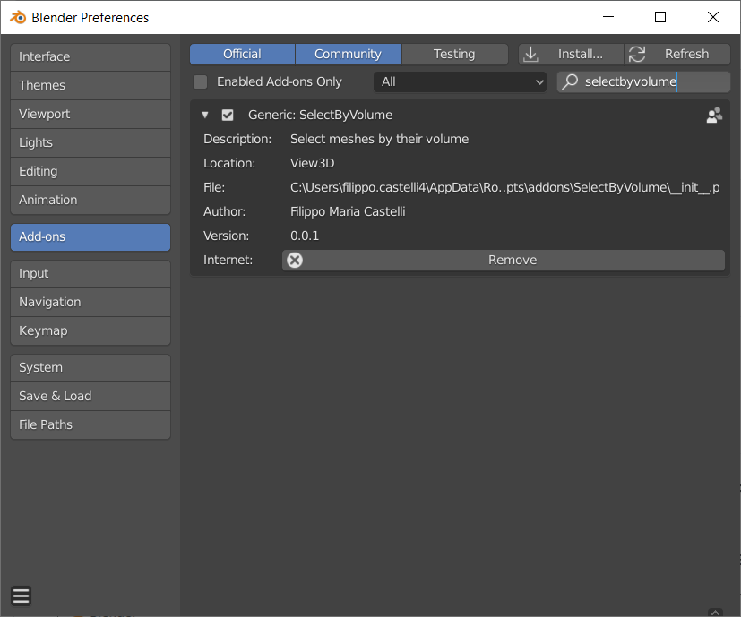
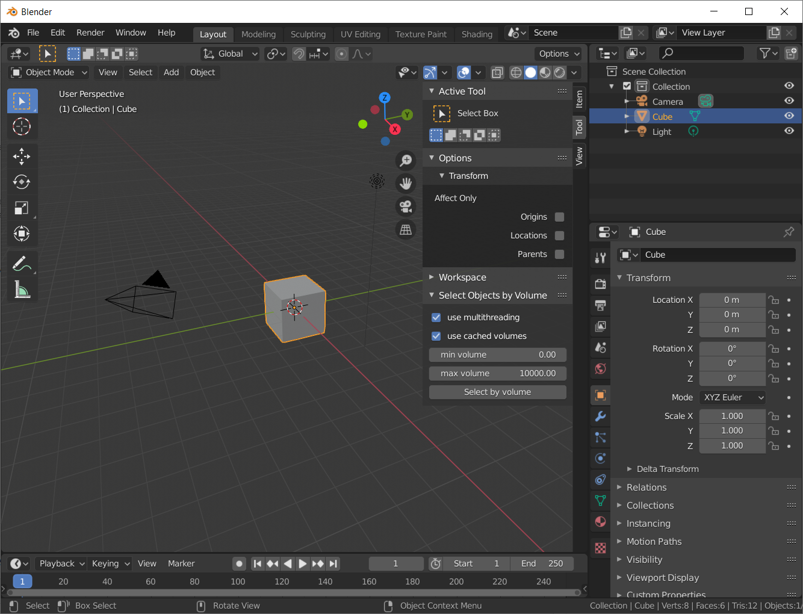

# SelectByVolume
Blender addon for volume-based object selection. 

## Requirements
*SelectByVolume* can be installed on Blender > 2.80
## Install
Download the latest release as a zip archive, in Blender go to **Edit > Preferences > Add-ons > Install** and choose `SelectByVolume.zip`.   
Ensure that you have activated the plugin by ticking its box and you're ready to go!

  

## Usage
In the *3D Viewer* mode, opening the side tab, under *Tools* you should be able to find the *Select Objects by Volume* panel.

  

You can choose a min and a max volume to bound your selection to and click on **Select by volume**: as simple as that.

If you're dealing with a large file with lots of objects you can enable the multithreading by ticking **use multithreading** to make best use of your CPU cores.
Selection can be furter speed up by storing and re-using the volume calculations with the **use cached volumes** button

## Notes
- **NOTE**: remember to do a run disabling the cache whenever you make changes to your objects.
- **NOTE**: by using the cache functionality you're adding a `sbv_volume` property to your objects, there are virtually no scenarios in which this creates problems but notice it's there.
## Planned Features 
- *Delete cache* button
- Automatic cache reset on mesh changes

## Contacts

**Author:**

Filippo Maria Castelli  
castelli@lens.unifi.it  
LENS, European Laboratory for Non-linear Spectroscopy  
Via Nello Carrara 1  
50019 Sesto Fiorentino (FI), Italy

