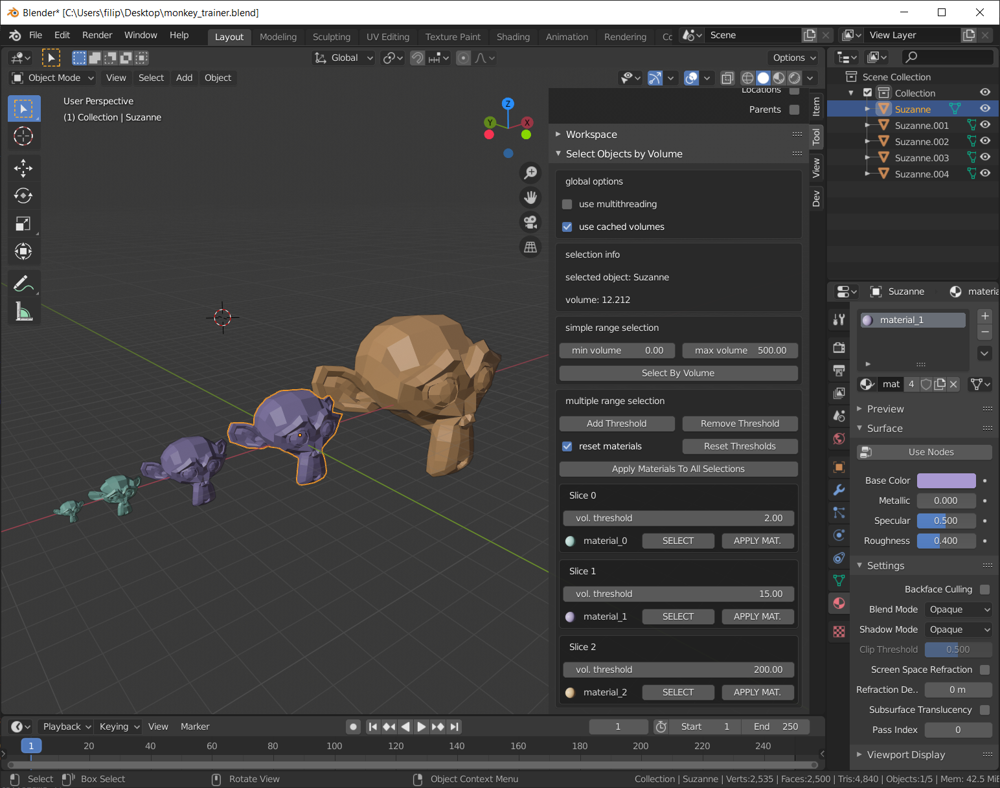

# SelectByVolume
Blender addon for volume-based object selection. 

## Requirements
*SelectByVolume* can be installed on Blender > 2.80
## Install
Download the latest release as a zip archive, in Blender go to **Edit > Preferences > Add-ons > Install** and choose `SelectByVolume.zip`.   
Ensure that you have activated the plugin by ticking its box and you're ready to go!

  

## Usage
In the *3D Viewer* mode, opening the side tab, under *Tools* you should be able to find the *Select Objects by Volume* panel.

  

### Simple Range Selection

  

In **Simple Range Selection** mode you can choose a min and a max volume to bound your selection to and click on **Select by volume**: as simple as that.

Selection can be furter sped up by caching volume calculations with the **use cached volumes** button

### Multiple Range Selection

  

If you need more than just selecting a simple range, you can use the **Multiple Range Selection** mode.

It's possible to add different volume thresholds using the **Add Threshold** button (or removing them when you don't need them anymore, with **Remove Threshold**).

You can select each individual threshold by clicking on the different **SELECT** buttons.

Each volume threshold introduces by default a basic material with a random color which you can edit but is not assigned until you either click on the **APPLY MATERIAL** button on each selection or just use the **Apply Materials to All Selections** button.

Lastly you can reset all the volume thresholds using **Reset Thresholds**, this deletes all the selection thresholds you may have created. This operation does not delete the created materials (that you might have edited and might not want to delete) unless the **reset materials** option is selected.

## Notes
- **NOTE**: remember to do a volume selection run disabling the cache whenever you make changes to your objects.
- **NOTE**: by using the cache functionality you're adding a `sbv_volume` property to your objects, there are virtually no scenarios in which this creates problems but notice it's there.

## Planned Features 
- *Delete cache* button
- Automatic cache reset on mesh changes
- Colormap based material color assignment
- Manual election of a "base" material to build all materials on

## Contacts

**Author:**

Filippo Maria Castelli  
castelli@lens.unifi.it  
LENS, European Laboratory for Non-linear Spectroscopy  
Via Nello Carrara 1  
50019 Sesto Fiorentino (FI), Italy

